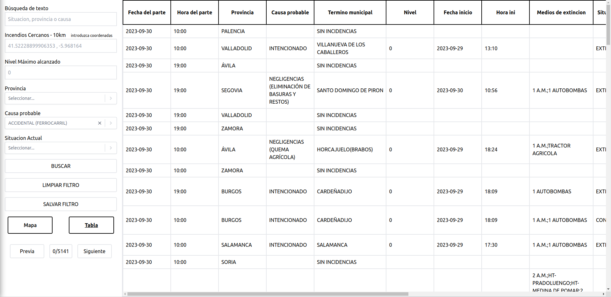
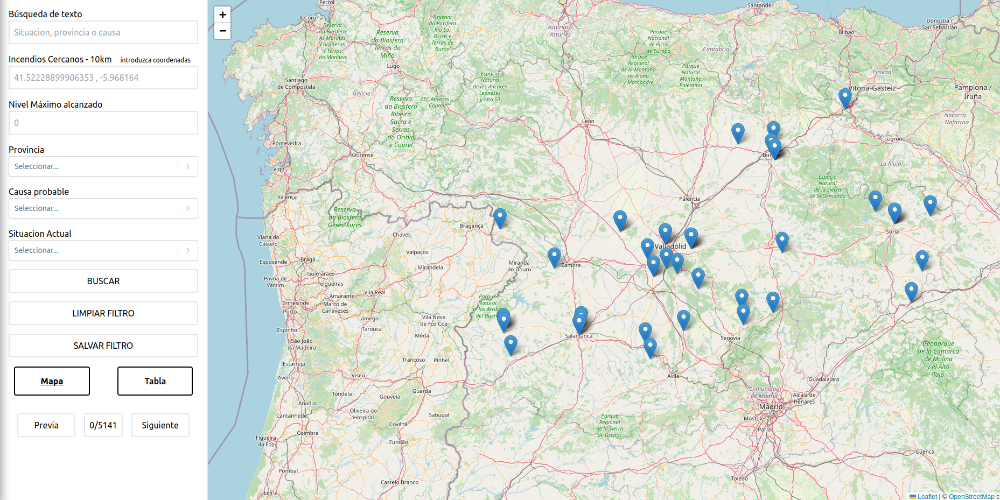

# Fires in Castilla y León

## Description

This web application provides real-time information about forest fires detected in Castilla y León, Spain, during the last two years. It utilizes an open data API from [Datos Abiertos de la Junta de Castilla y León](https://analisis.datosabiertos.jcyl.es/api/explore/v2.1/console).




## Requirements

### Features

1. Table with pagination to display the data that the open API provides .
2. Filters for the data table to allow users to filter information by:
   - Province
   - Probable cause
   - Current situation
   - Maximum level reached
3. Interactive map for geolocating the forest fires.

### Additional Features

1. Users can save their selected filter configurations in the browser's local storage.
2. By giving latitude and longitude separated by commas, you can search for nearby fires (10km)

## Getting Started

Follow these instructions to get a copy of the project up and running on your local machine for development and testing purposes.

### Prerequisites

- Node.js and npm (Node Package Manager) installed on your system.

### Installation

1. Clone the repository:

```
git clone https://github.com/BenjaminRiderelli/leon-castilla-fires
```
2. Navigate to the project directory:
```
cd forest-fire-app
```
3. Install the required dependencies:
```
npm install
```
4. Start the development server:
```
npm run dev
```

5. Open your web browser and access the application at `http://localhost:5173`.

## Usage

1. Browse the forest fire data in the table.
2. Use the filters to narrow down the displayed data according to your preferences.
3. Interact with the map to view the geolocation of forest fires.
4. Save filter configurations in the browser's local storage for future reference.
5. Utilize the data entry feature to search for nearby fires based on GPS coordinates.
6. See the exact geolocation of a fire by clicking in one of the pointers in the map

## Acknowledgments

- Thanks to [Datos Abiertos de la Junta de Castilla y León](https://analisis.datosabiertos.jcyl.es/api/explore/v2.1/console) for providing the open data API.

## Authors

- [Benjamin Riderelli](https://github.com/BenjaminRiderelli)
